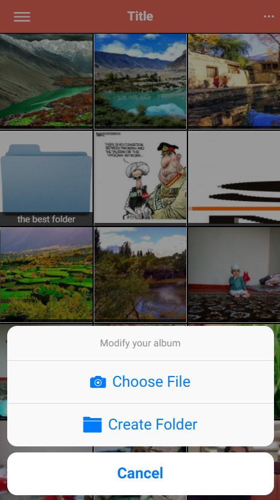
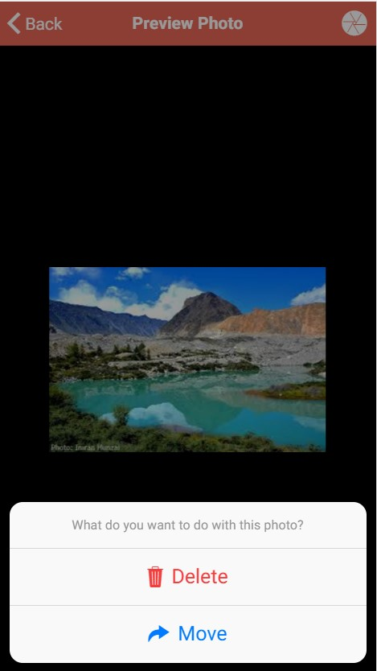
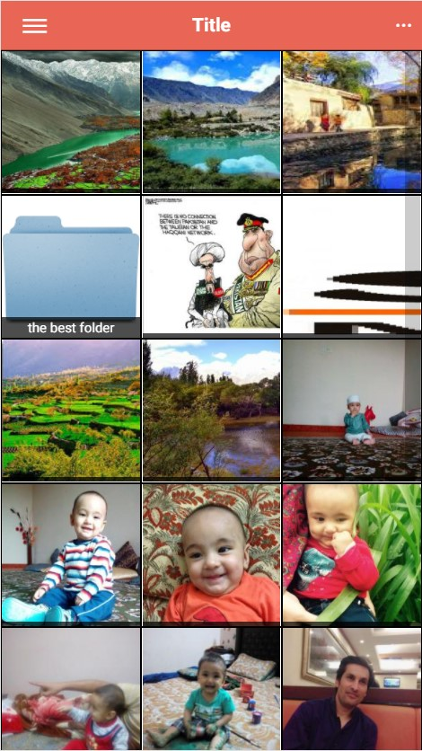

# Ionic Photo Gallery (Ionic2, Angular2, PHP)
A complete photo gallery hybrid mobile app and responsive web application. Tested on android, ios and chrome browser. 

<h3>Features</h3>
Upload Photo
Delete Photo
Move Photo
Create Folder
Browse a folder
Delete a folder
Browse photos by just swaping finger
zoom photos

<h3>Tools Used</h3>
Ionic 2
Angular 2 (TypeScript)
PHP (For server)

<h3>How to install</h3>
<h4>Back-end (Server)</h4>
 1. Create a MySQL database and dump the 'database_dump.sql' file from the root directory
 2. Edit the file Controllers/Db.php and add db credentials
 
 <h4>Front End</h4>
  1. Edit the file fpv1/src/pages/globals.ts to confirm your server links etc
  
  <h3>Run the App</h3>
  Since the fpv1 folder is the ionic app. And within the fpv1 folder enter this command 
  <code>inonic serve</code> 
  The app will open in the browser, enter the username and password (pu1,123) 
  And it's done! Enjoy!
  
  <h3>Screen Shots</h1>
   
   
     
       
